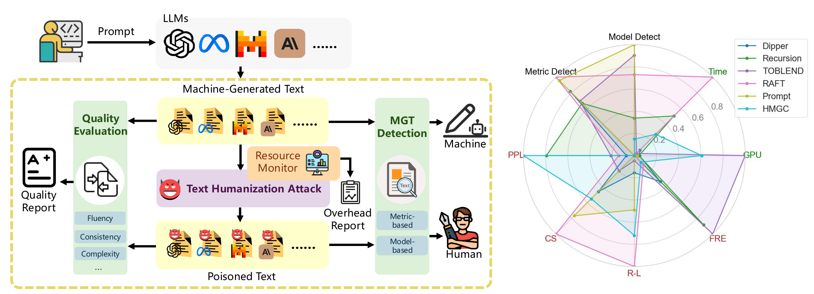

# TH-Bench: Evaluating Evading Attacks via Humanizing AI Text on Machine-Generated Text Detectors



## Quick Start

### Clean Data Preparetion
```bash
# create env for clean data generation $attack in ("dipper" "recursive_dipper" "token_ensemble" "raft")
conda create -n attack_run python=3.9
conda activate attack_run
pip install -r requirements_for_attack_run.txt
# generate clean mixed human and $model data file for MGTbench2 in cat, $model in ("Moonshot" "gpt35" "Mixtral" "Llama3" "gpt-4omini")
python attack_run.py --detectLLM $model --datatype mgt2
# generate clean mixed human and $model data file for MGTbench2 in topic, $model in ("Moonshot" "gpt35" "Mixtral" "Llama3" "gpt-4omini")
python attack_run.py --detectLLM $model --datatype mgt2_topic
# please follow https://github.com/xinleihe/MGTBench to download the orginal data file, you can download them from [Google Drive](https://drive.google.com/drive/folders/1p4iBeM4r-sUKe8TnS4DcYlxvQagcmola?usp=sharing), then put them into ./data dir
# generate clean mixed human and $model data file for MGTbench, $model in ("ChatGPT-turbo" "ChatGLM" "Dolly" "ChatGPT" "GPT4All" "Claude" "StableLM")
python attack_run.py --detectLLM $model --datatype mgt1
```

### Attack in ("dipper" "recursive_dipper" "token_ensemble" "raft"), the attack file is pre_dataset/clean_${model}_${attack}.csv
```bash
# $attack in ("dipper" "recursive_dipper" "token_ensemble" "raft")
conda activate attack_run
python attack_run.py --detectLLM $model --attack $attack --datatype mgt1/mgt2/mgt2_topic
``` 

### HMGC attack, the attack file is pre_dataset/clean_${model}_${dataset}.csv 
```bash
conda env create -n hmgc python=3.9
conda activate hmgc
pip install -r requirements_for_hmgc.txt
python flint_attack.py  --model_name_or_path ${model_dir} --output_dir ${output_dir} --attacking_method dualir --dataset ${model}_${dataset}
```

### prompt attack Use the following prompt to rewrite the text：
```bash

1. Your task is to rewrite the below article which must satisfy the following conditions:
2. Keeping the semantic meaning of the new article unchanged;

The new article should be classified as human-written.

Only output the new article without anything else.

Please rewrite the following article while incorporating the word usage patterns:
{origin_article}

Aim to diverge from the original text's style and expression.
```
Please use your own local model or API


## Measure Attack Efficiency

### benchmark using MGTBENCH2.0, follow the ../README to do the benchmark
```bash
cd ../
conda env create -f mgtbench2.yml;
conda activate mgtbench2;
# you may need mirror for faster installation
pip config set global.index-url https://mirrors.cloud.tencent.com/pypi/simple
pip install -r requirements.txt
cd run
python benchmark.py --csv_path ${the_result_file_path} --method ll --detect_LLM ${LLM} --localdata ${attacked_csv_flie_path}
# calculate the quality of attack
python text_quality_cal.py --detectLLM Moonshot --dataset Physics --attack raft
```

## Measure Text Quality

### Dependencies
```bash
pip install transformers torch pandas numpy scipy rouge_score textstat
```

### Usage
```bash
python text_quality_cal.py --detectLLM [LLM_MODELS] --dataset [DATASET] --attack [ATTACK_METHOD]
```

Available LLM models:
- Moonshot
- gpt35
- Mixtral
- Llama3
- gpt-4omini
- ChatGPT-turbo
- ChatGLM
- Dolly
- ChatGPT
- GPT4All
- Claude
- StableLM

Example:
```bash
python text_quality_cal.py --detectLLM Moonshot gpt35 --dataset Physics --attack raft
```

The tool will output statistics including perplexity, semantic similarity, ROUGE-L scores, and Flesch readability metrics.

## Resource Monitor
```bash
conda activate attack_run
# if you want to collect time and gpu usage in attack, use this cmd
python attack_run_topic_gpu.py --detectLLM $model --attack $attack --datatype mgt1/mgt2/mgt2_topic
conda activate hmgc
python flint_attack_topic_gpu.py  --model_name_or_path ${model_dir} --output_dir ${output_dir} --attacking_method dualir --dataset ${model}_${dataset}
```
The tool will out gpu usage and time usage in ${output_dir}, name like gpu_uasge*.log